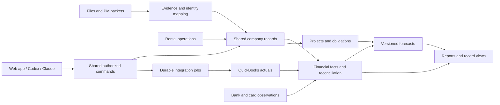

# R-Ops Updated Rollout Roadmap

September 23, 2026

## Outcome

Build one company operating platform where Codex and Claude can do the same authorized work as Michael in the web app. Rental activity, project execution, investor obligations, QuickBooks actuals, and forward planning must connect through shared records and calculations.

QuickBooks remains the accounting authority. R-Ops owns operating records, relationships, evidence, budgets, schedules, and forecasts. A tenant receipt, PM disbursement, QBO transaction, and bank deposit are related records; they are not four separate sources of revenue.

This roadmap updates the original build plan against the inspected code and current files. It does not authorize posting accounting corrections, change live tenant records, or certify every feature as operational. Mac application work stays with Claude's separate workstream.

## 1. Where the project stands

Inspection baseline: `/Users/michaelmcelwee/Projects/r-ops`, commit `7d97a2dd98021d21c97a5ae2979f9ad043b19b95`, branch `claude/rops-design-system`. Refresh the checkout and deployment identifiers before execution; do not assume they remain unchanged.

| Area | Existing foundation | What remains before calling it complete |
|---|---|---|
| Website and application | Branded domain, public legal pages, manager login, deployed application, and database migration evidence exist | Recheck the current deployment; bootstrap and verify company organization, entity, property-period, and user grants |
| Rental operations | Tenant, unit, lease, charge, ledger, occupancy, collections, and operational report functions | Resolve specific data exceptions; prove history coverage and agreement between web, reports, portal, and agent reads |
| Navigation | Ten requested categories exist | Remove disabled placeholders, reorganize around work, replace redundant status destinations with useful page filters |
| QBO | OAuth, encrypted tokens, refresh controls, connection scopes, mirror and command infrastructure, sandbox work | Durable dispatch and recurring sync, webhook/CDC recovery, complete entity mapping, production approval and grants, live readback and reconciliation |
| Projects | Scope, budgets, schedule, costs, commitments, changes, purchasing and draw foundations | Connected actuals, complete daily workflows, cost-to-complete, document links, validated reporting and real-project acceptance |
| Investors and debt | Contracts, obligations, debt and monthly payment records; QBO allocation interfaces | Load and reconcile actual agreements, verify settlement independently, connect obligations to cash planning and reporting |
| MRA packets | Stage/map/preview/apply primitives | Root HTTP/MCP wiring and real-packet end-to-end validation; manual app displays results only |
| Employee time | Separate time integration, mappings, sync and review foundations | Actual account connection, employee/job mappings and end-to-end payroll/project-cost reconciliation |
| Reporting | 53 catalog entries: 11 original reports and 42 expansion reports; saved presets/packages and versioned report services | Runtime readiness differs by report. Source inspection found 25 engine-backed reports and 6 additional QBO-conditional reports; remaining reports need ports/calculations/mappings. None of these counts proves live completeness |
| Forecasting | Workbook models and report definitions | A production forecast engine, scenarios, integrated statements, charts and tested actual-to-forecast transitions |
| API/MCP | Authenticated `/mcp`, shared service modules, broad tool registration | Real Codex and Claude connection tests, bounded outputs, accurate contracts, complete adapters, permissions and current setup documentation |

The previous release evidence verified 28 public routes and 42 database migrations. That is deployment evidence, not acceptance of every company workflow. Existing Mac-related uncommitted files must remain untouched. During final save, additional uncommitted QBO changes appeared in `scripts/company/qbo-sandbox.ts`, `server/accounting/http.ts`, `server/accounting/index.ts`, `server/integrations/quickbooks/oauth.ts` and `shared/accounting/quickbooks/types.ts`. Their owner and completed behavior were not established in this review. U00 must coordinate and re-inspect these changes before treating this source snapshot as current. Previous test totals are historical and must not be presented as current results.

### Existing documents to retain

- `R-ops Build Plan.md`: overall product scope and original packet definitions.
- `R-ops Design Specification.md`: brand, original dashboard structure, visual and accessibility rules.
- `R-ops Reporting Specification.md` and `R-ops Report Filter Matrix.md`: report semantics and filter requirements.
- `execution-manifest.json`: original scope inventory; preserve completed work and attach new acceptance evidence rather than resetting it.
- `HANDOFF-2026-09-22.md` and deployment evidence: implementation and release history.

This roadmap controls the new ordering and refinements below. It does not silently drop the original scope.

## 2. Product architecture

Keep the existing React/TypeScript, Express, Drizzle and PostgreSQL platform. Extend the existing shared contracts and domain services. A replacement application or second company database would create unnecessary reconciliation work.

### Domain ownership

| Data | Authority | R-Ops behavior |
|---|---|---|
| People, tenancies, units, lease dates, rent schedules, work orders | R-Ops with retained supporting evidence | Effective-dated history, scoped reads, revision-controlled edits |
| Posted financial transactions, chart of accounts, book balances | The correct QBO company | Mirror verified source records; edit through supported accounting commands and refresh after confirmation |
| Bank activity and settlement | Bank/Plaid observations matched to accounting | Reconcile timing and identity; a bank feed is not another income ledger |
| Card spending | Ramp source and its designated accounting integration | Reuse the existing writer; do not repost expenses already transmitted to QBO |
| PM collections, retained funds and owner remittances | Source PM statement plus rental records, reconciled to QBO and bank evidence | Preserve gross detail and the clearing relationship |
| Project scope, estimates, budgets, commitments, forecast costs | R-Ops | Link QBO actual lines and time costs without turning a budget into a posted expense |
| Investor/debt terms | Executed agreements and amendments linked to account records | Version terms and obligations; separately track accounting entries and settlement |
| Forecast assumptions and scenarios | Approved, versioned R-Ops planning records after migration | Preserve source workbook and manual overrides; never post a forecast to QBO |
| Documents | Existing company/property files and private document storage | Stable record links, permissions, hashes, retention and expiring downloads |

### Required common structures

Extend existing models where possible: legal entity and QBO realm bindings; effective property ownership; stable person, tenancy, vendor, investor and project IDs; source document references; source transaction and line bindings; allocation records; evidence-backed review cases; settlement matches; dated mapping versions; forecast scenarios, assumptions, events and snapshots.

Use exact decimal/cents arithmetic, explicit currencies, accounting dates and local operational dates. Preserve deleted/voided source history through tombstones or reversals. Never deduplicate by amount and date alone. Store source payloads and evidence privately, with redacted logs and least-privilege access.

Long-running work uses a durable database-backed queue and a separately managed worker. Reuse the existing outbox; verify its dispatcher is actually running. Choose one queue implementation compatible with the pinned runtime and Replit deployment. Support leases, retries with backoff, unique job keys, checkpoints, dead-letter handling and operator recovery. Do not depend on a browser tab, an in-memory timer, or one HTTP request staying alive.

## 3. Elegant rental and QBO integration

### One connected financial view

Every property financial page should show rent scheduled, charges earned, tenant and subsidy collections, arrears, deposits held, PM fees/expenses, funds held by the manager, owner remittances, bank settlement, operating results and project spending. Display distinct measures with a clear period and basis. Do not label all of them “income.”

A click on a number should open the contributing records: unit/tenant or project, original evidence, allocations, QBO entry and settlement where available. Summaries should come from the same service used by reports and agents. QBO technical IDs belong in detail, not in the main interface.

For each QBO connection, bind organization + legal entity + environment + realm. Bind transactions at entity/type/ID/line level with source version or SyncToken and dated mappings. Maintain the relationship between one economic event and all observations of it. Transactions copied into multiple modules remain one actual amount.

### Example: PM collection to bank

For an illustrative $1,000 tenant rent receipt with $100 of manager costs and a $900 owner remittance:

1. Record the $1,000 receipt against the correct tenancy and charge allocation.
2. Identify the PM-held funds and $100 expense from statement detail.
3. Match the $900 remittance to its clearing movement and bank receipt.
4. Verify the relevant QBO entries and closing clearing balance.
5. Report $1,000 of rent collections, $100 of costs, and $900 remitted—not $1,900 of income.

Actual posting accounts and basis must follow the entity's approved accounting policy. Security deposits, tenant prepayments, subsidy receipts, refunds, returned payments and owner contributions each require their own treatment.

### Posting ownership

Select exactly one rental accounting method for each entity and effective period:

- **Native QBO receivables:** supported customers/invoices/credits/payments provide the book-level detail.
- **Approved summary bridge:** R-Ops retains tenant detail and a reconciled periodic bridge updates QBO with explicit control totals.

Never use both methods for the same activity. The decision depends on current books, existing PM accounting, volume and reconciliation—not preference for a technically convenient API. Migration between methods requires an opening-balance bridge and a dated cutoff.

R-Ops edits to financial records follow prepare → validate → authorized submit → source readback → reconcile. An uncertain network response is an unknown outcome, not permission to repost. Recover using the stable request identity and source lookup. Stale source versions require reread and a new conflict decision. Prior-period changes reopen relevant reconciliations and reports; locked periods are not silently rewritten.

### Integration implementation sequence

1. Bootstrap company access and dated property/entity/account mappings.
2. Complete durable worker dispatch and connector health reporting.
3. Implement webhook verification, event deduplication, affected-record fetches and catch-up polling/CDC, including deletes and missed notifications.
4. Complete source transaction coverage and explicit unsupported-operation behavior.
5. Reconcile a sandbox entity through a complete rental/PM period first. Add cross-module project and investor fixtures after those workflows are integrated; they do not block the foundational rental bridge.
6. Obtain production credentials and each entity's OAuth grant; connect read-only first.
7. Compare opening balances, trial balance, GL, P&L, balance sheet and bank/PM clearing to source reports before activating writes.
8. Enable only tested write types. Keep unsupported cases held with an exact reason and a source-system link.

Use the current Intuit CloudEvents webhook format, including deliveries containing more than one realm. Persist and deduplicate events by their source identity, acknowledge promptly, and fetch the canonical objects through the correct company connection. CDC has a bounded recovery window; after a gap beyond supported coverage, perform a scoped full resync and reconcile deletions instead of claiming catch-up is complete. Verify customer-facing invoice delivery preferences before testing native receivables creation so a bookkeeping operation cannot unexpectedly email a tenant. [Intuit webhook migration](https://medium.com/intuitdev/upcoming-change-to-webhooks-payload-structure-2a87dab642d0)

QBO Projects and QuickBooks Time are separate capability checks. The standard accounting connection must not imply access to every Projects, construction, payroll or time function. Keep R-Ops project planning usable when an optional QBO capability is unavailable. Check current subscription and API entitlements at implementation; do not recommend a subscription change from stale pricing.

## 4. Replace generic “Needs review” with an evidence-backed resolution workflow

The current label combines several conditions: missing values, ambiguous identity, incomplete imported history, conflicting observations and genuine ledger problems. It is not currently a complete issue-management system. Clearing text in the interface would not fix those causes.

### Case model and resolution

Create a scoped review case with reason code, affected records, as-of date, financial impact if determinable, source fingerprint, supporting evidence, proposed correction, current revision and resolution status. Use states: open, researching, proposed, applied and verified, or blocked on a named missing fact. Reopen a resolved case if relevant evidence changes.

Deduplicate cases by cause and scope. A single missing import partition may affect many tenants; do not turn that into dozens of unrelated user decisions. Preserve affected-record counts separately from case counts.

| Cause | Research and resolution | Required verification |
|---|---|---|
| Missing or conflicting tenancy identity | Executed lease, amendments, unit aliases, dated PM emails and actual occupancy evidence | Correct person + unit + tenancy + effective date; preserve transfers and future tenancies |
| Missing receipt/allocation | Receipt, payer identity, tenant/HAP split, bank observation and source ledger | Amount and source identity match; no prior posting or duplicate; allocated once |
| Incomplete history | Original archive partitions, pagination, source IDs, dates, counts and control totals | Complete coverage evidence passed to readers; absence of errors alone is insufficient |
| Conflicting operational balance | Source-dated PM observation versus account/tenancy detail | Preserve operational observation separately; do not overwrite the posted ledger |
| Missing rent or occupancy dates | Lease terms, effective changes and move-in/out evidence | No inferred occupancy from an inquiry, signed future lease, or marketing status alone |
| Software connection or unsupported type | Connector configuration, runtime route or capability | Fix the connection/code; do not ask tenant research to solve infrastructure gaps |

Research locally first, then relevant complete email conversations, attachments and other authorized sources. Resolve property, entity, unit, person and period before making a proposal. Use recent dated evidence over an outdated snapshot, while preserving conflicts for investigation. Search text messages only through an available authorized channel. Text access was unavailable during this planning pass; do not substitute unrelated computer access for withheld messages.

The reviewed business Gmail thread demonstrated why context matters: a signed future lease and a partial security-deposit receipt must not become current occupancy or fully paid rent. Its attachments, bank evidence and live R-Ops state still need verification before any change. No case was cleared during this planning pass.

Apply supported, unambiguous operational corrections through guarded commands with before/after revisions, evidence references and saved readback. Financial changes use the accounting workflow and appropriate authority. Retain the existing safe maintenance/reconciliation machinery rather than creating a direct SQL cleanup path.

### User experience

Use short specific statuses such as “Lease missing,” “Receipt unmatched,” “History incomplete,” or “QBO disconnected.” A single action queue groups cases by cause and materiality. Show the impact, proposed fix and underlying evidence on opening a case. Keep technical provenance out of default tables.

A known subtotal may be shown when its scope is explicit; an unknown amount is never zero. Incomplete material information prevents a total from being described as complete or verified. Portal balances, statements, collections and checkout gates must use the same certainty rules.

**Release gate:** inventory all active cases, automatically resolve those with sufficient evidence, and leave only a bounded list with exact missing evidence, affected scope and next action. Do not promise zero flags by suppressing uncertainty or inventing data.

## 5. Navigation and page information

The inspected navigation repeats current/future/former/all tenant links, mixes actions into destinations, and advertises disabled planned sections. Replace that structure with useful workspaces.

Keep the ten requested top categories. Dashboard opens directly; it does not need a one-item dropdown. Other menus have one level, short labels and approximately four to six meaningful destinations. Expose a destination only when it works. Show unavailable QBO connections inside the relevant workspace rather than filling navigation with dead links.

| Category | Proposed destinations | Useful information on the landing page |
|---|---|---|
| Dashboard | Direct link; no dropdown | Original RM-style operating layout: collections, occupancy, upcoming obligations, actionable exceptions and work due; compact cash-outlook entry |
| Properties | All properties; Performance; Rent roll; Documents & compliance | Occupancy, scheduled rent, collections, arrears, trailing NOI, work and capital exposure |
| Tenants | Directory; Collections; Leases & renewals; Move-ins & move-outs; Applications | Unit, lease status/dates, balance with certainty, next charge, last receipt, deposit and subsidy status |
| Units | All units; Availability; Make-ready; Listings | Occupancy, market/lease rent, ready date, days vacant, work remaining and leasing stage |
| Accounting | Overview; Transactions; Bills & payments; Banking & reconciliation; PM settlements; Period close | Cash by entity, receivables/payables, deposits held, clearing differences, integration freshness and close progress |
| Projects | All projects; Schedule; Budgets & costs; Commitments & changes; Draws; Cost library | Approved budget, committed, incurred, paid, forecast final cost, remaining cash and schedule risk |
| Work Orders | Open work; Schedule; Preventive maintenance; Completed work | Priority, assignee/vendor, unit, due date, aging, estimated/actual cost and completion |
| Investors | Accounts; Payment calendar; Contributions & distributions; Debt & maturities; Agreements | Principal/capital, upcoming obligations, posted and settled payments, arrears, maturity and linked documents |
| Reporting | Report library; Saved reports; Packages; Forecasting | Recent saved outputs, favorites, available report families, periods and actionable source gaps |
| Company | Entities & ownership; People & vendors; Team & time; Documents; Settings | Company relationships, staff and contractor records, access, integrations and administration |

“New work order,” “Record receipt,” and similar actions belong in the page toolbar. Current/future/former tenants belong in the Directory status filter. Project “Execution” becomes recognizable commitments, changes, purchasing and draw views. Global preferences, website link and sign-out belong in the account menu. Preserve old deep links with route aliases.

Forecasting is a full workspace under Reporting, also reachable from the dashboard cash outlook and property financial pages. It is not buried in a long report list. Its tabs are Cash, Income, Balance sheet, Debt, Scenarios and Assumptions. The same workspace receives context from each entry point.

### Record pages

- **Property:** Overview, Rent roll, Financials, Projects, Work orders, Documents. Financials joins rental operating detail and QBO actuals using the selected period and entity mapping.
- **Tenant/tenancy:** Overview, Ledger, Lease, Deposits & assistance, Documents, History. Keep multiple tenancies and payer roles distinguishable.
- **Unit:** Overview, Tenancies, Make-ready, Work, Listing, Financials. Date-sensitive occupancy is explicit.
- **Project:** Overview, Scope & budget, Schedule, Costs & commitments, Draws, Files. Each cost can reveal its invoice, QBO line, allocation and settlement.
- **Investor:** Overview, Monthly payments, Capital activity, Agreements, Debt, Statements. Scheduled, posted, settled and reversed are separate states.

Avoid duplicating data pages for each menu entry. Use one canonical record view and scoped links. A global property/entity context may prefill a page, but cannot silently broaden permissions or inject inappropriate filters into a report.

### Filters and controls

| Workspace/report | Primary controls | Additional filters |
|---|---|---|
| Tenant directory | Property; status; search | Unit, lease expiration, subsidy, missing documentation |
| Rent roll | Property; dependent unit selector; as-of date | Lease/occupancy status, balance categories, fixed/at-will terms, selected columns |
| Tenant statement | Tenant/tenancy; date range | Transaction categories and reconciled allocation detail |
| Delinquency | Property; as-of date | Aging bucket, amount threshold, tenancy status, balance certainty |
| P&L/T12 | Entity/property; date range; basis | Comparison period, approved account grouping, detail level |
| Balance sheet | Entity; as-of date; basis | Comparison date; consolidation/elimination version when applicable |
| Project costs | Project; period | Vendor, cost code, commitment, incurred/paid state, approved change status |
| Work orders | Property; status; assignee | Priority, type, due-date range and vendor |
| Investor payments | Investor/entity; payment month | Due/partial/posted/settled/reversed, instrument and currency |
| Forecasting | Scenario; horizon; property/entity | Weekly/monthly view, reserve threshold and comparison scenario |

Use searchable selects for long entity/property/vendor lists, a small segmented control for two or three mutually exclusive views, checkboxes for genuine multi-selection, and date presets with a custom option. Clear a dependent unit selection when changing properties if it no longer applies. Display applied filters compactly, allow reset, and save only valid combinations.

Report-specific setup appears before Run. Rerun is explicit when filters change; label displayed results with their executed filters. Hidden fields must not affect the result. Do not expose raw model/input version strings as user form fields; scenario selection resolves these internally. Advanced controls appear only for applicable reports. Report messages and customization are optional, not mandatory clutter.

### Design standard

Retain company charcoal/green, gold and warm neutrals from the existing design specification. Preserve the original dashboard's useful information structure. Apply clear typography, disciplined spacing, simple bordered tables, restrained emphasis and progressive disclosure. Glass is optional chrome treatment, never a background that reduces table readability. No decorative subtext, agent avatars, or permanent technical explanations.

Keyboard navigation, visible focus, VoiceOver labels, reduced transparency/motion and adequate contrast are acceptance requirements. On narrow screens use an accessible section selector/overflow pattern, not ten cramped labels or a restored recently-used sidebar. Test the real dense financial tables on a 13–15 inch Mac display and mobile widths.

### Comparable-product findings

Buildium connects payments, fees, deposits, expenses and financial reporting; adopt connected record context and clear operating/accounting distinctions. [Buildium accounting](https://www.buildium.com/features/property-management-accounting/)

Procore's budget tooling connects commitments and cost changes; adopt those distinctions in project views rather than a vague “Execution” menu. [Procore budget](https://support.procore.com/products/online/user-guide/project-level/budget)

Fathom supports connected P&L, balance sheet and cash-flow forecasting with scenarios; adopt linked statements, explicit drivers and scenario comparison. [Fathom forecasting](https://support.fathomhq.com/en/articles/4616642-get-started-with-forecasting)

Rent Manager's broad report library supports retaining deep operational reports and customization without putting every report in top navigation. [Rent Manager reporting](https://www.rentmanager.com/reporting/)

These are recommendations derived from public product documentation, not a claim that every competing application was tested in an authenticated session. The proposed menus are tailored to Michael's work and the current R-Ops code.

## 6. Institutional forecasting

### Preserve and migrate the actual model

The inspected `Portfolio Overview.xlsx` has 15 sheets. Cashflow spans 502 rows and 52 columns with 1,581 formulas; 1,574 had saved cached results. The read-only inspection did not recalculate or change the file. Missing cached values and manual starting balances require native recalculation and reconciliation before becoming migration acceptance fixtures.

The current Cashflow model includes weekly dates from September 25, 2026 through January 1, 2027 and monthly periods for 2027; rental receipts, first-month rent and RUBS; project labor/materials/carry; investor payments and balloons; debt service; sales/refinancing; lease-up assumptions; and owner/personal cash. It explicitly labels ending cash as before missing costs and marks a labor section retired. Preserve those meanings.

`3YR Plan.xlsx` has six sheets and an older June 2026 modification date. Treat its growth/refinance assumptions as a scenario to review, not current approved deal terms. Inventory formulas, named ranges, dependencies, hardcoded overrides and external links before cutover.

### Required model layers

1. **Actual opening position:** reconciled QBO balance sheet and cash, current rental receivables, deposits, PM-held funds, AP, project commitments, debt and investor obligations. Each has an as-of date and completeness state.
2. **Operating drivers:** unit-level lease schedule, vacancy/make-ready dates, concessions, collections and bad-debt assumptions, tenant/HAP portions, PM fees and remittance lag, recurring utilities/insurance/taxes and payroll.
3. **Project drivers:** scope quantities, budget, actuals, remaining commitments, cost-to-complete, procurement timing, labor, draws and retainage. Work completion changes ready dates and downstream rental cash.
4. **Financing and capital events:** amortization, principal/interest, escrow, maturity, extensions, prepayment costs, refinance constraints, closing costs, sale proceeds, deposits transferred and investor distributions.
5. **Three linked statements:** income statement, book balance sheet and cash-flow statement. Roll forward AR/AP, deposits, prepayments, fixed assets/CIP, depreciation, debt and equity. No balancing plug hidden in cash or equity.
6. **Treasury cash schedule:** dated receipts/disbursements, restricted versus available funds and reserve floors. Reconcile this direct cash view to the statement-based cash movement.
7. **Scenario engine:** base, downside, upside and specific hold/sell/refinance cases; versioned assumptions, dated events, deterministic calculations and immutable snapshots.

Use a daily event calendar under weekly and monthly views. Default to a rolling 13-week cash view and 36-month monthly projection; support longer debt horizons without truncating balloons. Define nonoverlapping periods so the January 1 weekly bucket and January monthly bucket cannot double count cash.

Separate forecast values from actuals at an explicit cutoff. Preserve approved overrides with author, effective period and reason in internal records. New actuals update future projections through an intentional reforecast; they must not silently rewrite an issued investor or lender package.

Company book value and estimated market value/equity are different views. Owner/personal cash belongs in an optional owner planning view and never contaminates company P&L or QBO books. Gross loan proceeds, an expected draw, and net usable cash after payoff/costs/reserves are separate measures.

### Views and charts

| View | Decision it supports | Required drilldown |
|---|---|---|
| Weekly cash line with reserve floor | When cash becomes constrained | Opening cash, dated inflows/outflows and restricted balances |
| Base/downside/upside comparison | Sensitivity to timing and operations | Changed assumptions and contributing events |
| Cash bridge/waterfall | Why cash changed | Rental, operating costs, projects, debt, investor and capital events |
| Actual versus forecast variance | Where the model was wrong | Timing, volume, rate, classification and missing-source differences |
| Occupancy, rent and NOI | Effect of lease-up and operations | Units, ready dates, rents, collections and expenses |
| Project forecast-at-completion | Remaining funding and overrun risk | Budget, approved changes, commitments, actuals and uncommitted remaining work |
| Debt maturity and coverage | Refinance timing and financing exposure | Instrument terms, debt service, NOI, reserves and covenants |
| Balance-sheet composition | Liquidity, leverage and capital position | Account rollforwards and book-versus-market distinctions |
| Sensitivity grid | Rate, value, rent or timing thresholds | Explicit scenario inputs; no invented probabilities |

Do not use an LLM as the calculation engine. Agents may propose assumptions and explain deterministic results with supporting records. Probabilistic forecasting is a later enhancement only after data quality, calibration and correlations are defensible.

### Forecast acceptance

- Assets equal liabilities plus equity in every entity, scenario and period.
- Opening cash plus net movement equals closing cash; direct and indirect cash views reconcile.
- Net income, retained earnings/distributions and debt rollforwards agree; principal is not an operating expense.
- Lease-up, receipt, PM remittance and bank timing are separate events.
- Deposits remain liabilities until supported reclassification; subsidy cash is not duplicated with tenant rent.
- Moving a project completion date changes affected readiness, leasing, costs, collections and liquidity coherently.
- Refinance/sale scenarios include payoff, costs, reserves and restrictions; modeled proceeds never become available actual cash.
- Approved current-workbook cases reconcile after native recalculation. Differences are explained, not overwritten to force a match.
- Retired labor formulas stay retired; payroll/time actuals cannot duplicate estimated or QBO-posted labor.
- Forecast snapshots reproduce exactly from their model, mapping, source and assumption versions.

## 7. Reports, presets and packages

Use one generated report registry for the library, HTTP, MCP, filters and exports. Replace static “planned/available” labels with runtime capability: available, missing data/connection, or not implemented. An implemented engine is not proof that the selected scope has sufficient data.

Finish all 42 expansion reports alongside the 11 originals. Keep stable report IDs from `shared/report-catalog.ts`. The release inventory must record for each of the 53: engine, required sources, permitted scope, date semantics, basis, filters, formulas, totals, drilldowns, export formats and real acceptance evidence.

### Exact source-level report inventory

These groups describe inspected execution wiring, not live acceptance:

- **11 original rental paths:** `delinquency`, `lease-expiration`, `rent-roll`, `security-deposit`, `tenant-ledger`, `occupancy`, `scheduled-income`, `scheduled-vs-collected`, `collected-income`, `hap`, `applicant-pipeline`.
- **14 supplemental engine paths:** `current-tenants`, `rent-paid`, `renters-insurance`, `tenant-vehicles`, `unit-listings`, `contractor-exposure`, `project-performance`, `rehab-benchmark`, `completed-tasks`, `open-tasks`, `tasks-performance`, `vendor-details`, `investor-owner-activity`, `work-sessions`.
- **6 conditional QBO paths:** `balance-sheet`, `cash-flow-statement`, `general-ledger`, `income-statement`, `income-statement-detailed`, `trial-balance`. These need a configured connection and currently reject property-scoped runs.
- **12 blocked financial paths:** `balance-sheet-by-fund-type`, `balance-sheet-consolidated`, `budget-vs-actual`, `general-ledger-consolidated`, `income-statement-by-unit`, `income-statement-consolidated`, `trial-balance-consolidated`, `portfolio-financials`, `property-t12`, `accounts-receivable`, `accounts-payable`, `cash-position`.
- **10 other blocked paths:** `property-statement`, `rental-owner-ending-balances`, `rental-owner-statement`, `cash-forecast-13-week`, `operating-growth-plan`, `debt-refinance`, `exit-scenarios`, `leasing-agent`, `work-orders`, `lender-management-package`.

Fix three specific setup defects alongside engine work: forecast scenario/version fields currently go into generic `filters` although the engine expects `request.forecast`; grouping is offered for reports whose engines reject or ignore it; account/investor/project/vendor/staff references lack selectable UI options. These are functional defects, not merely menu styling. Generate scoped reference choices and capabilities from the same report definition consumed by both agents.

### Delivery groups

| Group | Scope | Hard dependency |
|---|---|---|
| Rental | Rent roll, collections, delinquency, lease ending, tenant statements, current tenants, paid rent, insurance, vehicles, listings, deposits, HAP and applicant pipeline | Complete authorized operational sources and dated tenancy identity |
| Book statements | GL, P&L and detail, balance sheet, cash flow, trial balance, AP | Correct QBO realm, period, basis, source availability and source-report tie-out |
| Combined financials | Property and unit results, T12, budget variance, cash position, AR, fund views, consolidated statements and owner balances/statements | Dated mappings, approved allocations, settlement links and elimination policy |
| Work and projects | Task performance, open/completed tasks, vendor detail, work orders, work sessions, contractor exposure, project performance and rehab benchmarks | Real domain readers, complete actuals/commitments/time and valid denominators |
| Planning and packages | 13-week cash, growth, debt/refinance, exits, investor activity and lender/management package | Versioned forecasts, agreements and required templates |

A consolidated report must show mapped company totals and approved intercompany eliminations; summing LLC reports is insufficient. Unit P&L must distinguish directly assigned costs from approved allocations and unallocated costs. A fund view requires a real fund definition, not an invented partition. Owner statements must reconcile reserves, liabilities and cash activity.

Saved presets persist valid filters, columns, sort and comparison settings with user/share permissions. Packages pin report versions and compatible dates/bases, create one immutable run, and identify incomplete components without calling the package complete. Exports must match the on-screen and API totals and prevent CSV formula injection. Use existing export infrastructure; add printable/PDF outputs and XLSX only where needed and validated.

Delivery/sharing is a separate explicit action. No automatic lender communications. MRA ingestion remains a Codex workflow, not a new Imports top-level page. Its results and exceptions may be opened from Accounting → PM settlements and linked records.

## 8. Complete the operating workflows

### Projects and purchasing

Carry a project from template/scope quantities through approved budget, schedule/dependencies, commitments, purchase orders, change requests, receipts, invoices, payment status, lender draws and closeout. Show original budget, approved changes, revised budget, committed cost, incurred cost, paid cost, remaining commitment and forecast final cost distinctly.

Actuals come from verified QBO lines or another designated accounting source; planned/manual costs remain operational until posted. Account for one invoice covering multiple units or projects with conserved allocation totals. Prevent commitment + bill + payment from becoming three expenses. Keep receipts, lien waivers, proof of work and draw documents linked. Cost library benchmarks use comparable completed scopes with quantity/unit/date/location context.

### Investors and debt

Connect each investor to agreements, entity/property participation, contributions, instruments, monthly obligations, payment log and statements. The monthly log includes due date, expected principal/interest/distribution components, linked QBO records, partial payments, settlement evidence, remaining amount and reversals. QBO posting alone is not bank settlement.

Load executed contracts and amendments before generating schedules. Support maturity/balloon payments, variable terms, prepayment rules and approved distribution priorities. An equity contribution, loan, preferred return and profit share must not share one generic liability treatment. Reconcile beginning balance + movements to ending balance per instrument and entity. Advanced waterfall structures are implemented only from actual agreements, not assumed industry defaults.

### MRA ingestion

Codex supplies the real packet to private storage. Validate file/page integrity, source identity and period; extract structured rows with page references; map tenants/units; identify duplicates and conflicts; preview changes/control totals; apply supported authorized changes atomically per independent tenant-account group; read back the saved results. Preserve packet-level progress, failed/held groups and control totals so partial application can resume without replaying successful groups. Replays must be harmless. Partial or revised packets must not erase previously verified history.

Build missing root HTTP/MCP adapters and read-only results views around the existing service. The browser can show what changed and what remains unresolved. No manual packet-upload wizard is required.

### Employee time

Prefer the supported QuickBooks Time/Workforce workflow for employee clock-in when the account is eligible. Prove the actual subscription, OAuth and company mappings before treating it as connected. R-Ops consumes approved time and job assignments, supports review/correction through supported paths, and allocates labor to projects/work orders.

Separate estimated labor cost, approved hours, payroll expense and bank-paid payroll. Do not double-count imported time cost and the eventual QBO payroll actual. Capture time zone/DST, overnight shifts, breaks, approvals, edits/deletions and unassigned work. A custom employee clock-in app is not a prerequisite and should not be built unless the native workflow fails a real requirement.

### Company database and remaining original scope

Finish entity/ownership relationships, contacts and contractor records, document metadata and secure retrieval, recurring obligations, utility/insurance/compliance dates, inventory/procurement where justified, and operational links to projects/work orders. Preserve existing main company/property folders as the document source; do not scatter duplicate archives into the code repository.

Inventory current Excel and Airtable records before migration. The original plan referenced 14 workbook sheets and 49 Airtable tables; the currently inspected main workbook has 15 sheets, so old inventories are not authoritative. Select one owner for each field after cutover. Use trial imports, source IDs, control totals, reconciliation and rollback. Keep historical snapshots; do not maintain competing editable masters indefinitely.

## 9. API and MCP: first-class product interfaces

Source inspection found a root-wired Streamable HTTP MCP endpoint and approximately 148 registered tools. The current guide describes a much smaller, ChatGPT-focused surface. The catalog size, setup instructions and actual client behavior must be generated and tested, not assumed from documentation.

### Required service contract

- Web, HTTP and MCP call the same authorized domain service; no agent-only bypasses.
- Publish machine-readable schemas and a generated HTTP/tool inventory with stable IDs and versions.
- Every read returns explicit scope, period, basis, completeness, source freshness and bounded results where relevant.
- Use cursor pagination for ledgers, search, reports and exports. Large exports return authorized, expiring artifact references rather than an entire file in tool text.
- Commands use idempotency keys, expected revisions and stable structured errors. Include retryability and required next action without leaking secrets or other entities' data.
- Correct read-only/destructive/idempotent tool annotations per operation; do not mark every write as equally destructive or non-idempotent.
- Preserve the human/OAuth actor and client identity in internal audit records. Recheck grants on each action and replay; a mapped shared admin cannot silently become multi-user authorization.
- Expose capability/status and a small context-discovery entry point so an agent can locate the organization, relevant record and supported workflow without guessing among 148 tools.

### Functional coverage

Support rental reads/edits, review-case research and guarded resolution, documents, MRA stage/map/preview/apply/status, project execution, investor/payment/debt records, time review, accounting connection/sync status, report runs/presets/packages and forecast scenario/run/compare/explain. Proposed review/forecast tool names should be defined in contracts before implementation; do not claim they already exist.

### Client setup and proof

Use `https://5central.capital/mcp` as the intended canonical public endpoint after discovery/issuer/audience/hosting verification. Preserve or deliberately migrate any existing Replit resource identifiers; do not just change an OAuth audience string and break current clients.

Provide separate copyable Codex and Claude Code setup guides plus client-specific instructions where desktop products differ. Verify OAuth protected-resource metadata, authorization-server discovery, supported client registration, callbacks, scopes, audience binding, token expiration and revocation. Pin a mutually supported protocol version; do not require an untested release candidate.

Acceptance requires each real client to authenticate, discover tools, read context, run a filtered report, page a large result, retrieve an authorized document, create an allowed test change with a retry-safe command, and read it back in the web app. Prove read-only denial, cross-entity/property denial, revoked access, stale revision rejection and resumed long-running jobs. Use isolated test data for writes. Test both clients, not just a standalone MCP library.

The official guides support remote MCP/OAuth setup, but compatibility of this deployment was not proven during this planning pass. [Claude Code MCP](https://code.claude.com/docs/en/mcp) · [Codex MCP setup](https://developers.openai.com/learn/docs-mcp)

## 10. Phased build with parallel work

Use Astra High for architecture, sequencing, decisions and integration review. Use Sol High for accounting correctness, authorization, forecasting architecture and difficult defects. Use Luna Max for bounded implementation, fixtures, inventories, UI wiring and documentation. With four available slots, run the orchestrator plus at most three workers.

Do not assign two workers the same files, migration registry or root registration module. Freeze shared contracts first. One integrator merges service exports, registers root adapters, assigns migration numbers and updates generated inventories. Parallelism follows dependencies; it does not bypass a prerequisite.

| Phase | Parallel lanes | Exit gate |
|---|---|---|
| 0 — Establish a trustworthy baseline | Access/deployment inventory; live review-case inventory and source research; current workbook/report/menu inventory | Exact current scope, company bootstrap plan, reason-coded exception counts and locked shared contracts |
| 1 — Make data trustworthy and integrations operational | Review resolution service and evidence batches; QBO worker/sync/reconciliation; navigation and shared record views | Verified operational corrections, sandbox connector recovery, useful working navigation |
| 2 — Complete connected workflows | MRA adapters and genuine packet; projects/time; investors/debt/settlement | End-to-end real workflow fixtures and conserved financial allocations |
| 3 — Deliver financial reporting and forecasting | QBO/combined report engines; deterministic forecast engine; report/forecast interfaces | Book tie-outs, three-statement checks, correct filters, reproducible scenarios |
| 4 — Agent parity and company migration | Both-client acceptance; Excel/Airtable cutover; remaining company/operations workflows | Full API/MCP usability, reconciled migration and no competing data masters |
| 5 — Production pilot and release | Financial close pilot; performance/accessibility/security; recovery and operator documentation | Measured launch gates, signed-off exceptions and tested rollback |

API contracts, authentication tests and both-client smoke checks begin in Phase 0/1; Phase 4 completes coverage. Forecast contract design and workbook fixtures start early; trusted production forecasts depend on actuals and mappings. Production-key approval can proceed in parallel with sandbox work. Do not delay every independent task while waiting for Intuit.

### Execution packets

Each packet produces a focused change, contract updates, appropriate tests and an evidence record outside the product interface. Acceptance includes actual saved readback, not just a passing mock or a screen toast.

| ID | Owner and dependencies | Work boundary | Acceptance |
|---|---|---|---|
| U00 Baseline | Luna Max; first | Inspect HEAD, dirty files, deployed SHA, DB migrations, access, original manifest and service availability | Current-vs-planned inventory; no Mac edits; unresolved deployment facts named |
| U01 Contracts | Astra/Sol High; U00 | Identity, mappings, review, financial source/settlement, forecast and report contracts; migration order | Domain ownership and invariant tests approved before parallel writers |
| U02 Review inventory | Luna Max; U00 | Enumerate exact active causes and affected records; source discovery | Counts by reason, overlap and materiality; no inferred live totals |
| U03 Review resolution | Sol High plus Luna fixtures; U01/U02 | Extend maintenance/reconciliation and expose guarded case commands | Evidence-linked proposals, stale-source protection, saved readback and reopen behavior |
| U04 Company activation | Sol High; U01 | Bootstrap organization/entities/grants and dated property mappings using verified identities | Correct user sees correct entities; denied scopes remain denied |
| U05 QBO transport | Sol High; U01/U04 | Outbox dispatcher, webhook, catch-up/CDC, token/retry recovery and monitoring | Crash/replay/outage/delete/concurrent-refresh tests; no duplicate write |
| U06 Accounting bridge | Sol High; U05 | Posting ownership, line mapping, rental/PM clearing, settlement and close | Rental/PM source-report tie-out and gross-to-net control tests per entity/period; later cross-module tests join U10/U11 |
| U07 Navigation | Luna Max; U01 | Navigation configuration, routes, page filters and context links | Every visible destination works; old links resolve; keyboard/mobile tests |
| U08 Connected views | Luna Max; U06/U07 | Property, tenancy, project and investor financial drilldowns | Same totals as services/reports; no duplicated actuals; useful empty/error states |
| U09 MRA | Sol High service review, Luna adapters; U01/U04 | Existing intake service, root HTTP/MCP registration, private documents, results; shared case contract from U01 | Genuine complete packet plus replay/revision/ambiguity tests; feeds U03 resolution without waiting for all cases to close |
| U10 Projects | Luna Max with Sol review; U01/U06 | Scope→commitment→change→invoice→draw→closeout, cost library | One actual allocated once; cost-to-complete and schedule/ready-date fixtures |
| U11 Investors/debt | Sol High; U01/U06 | Agreement ingestion, obligations, payment log, source and settlement bindings | Monthly rollforward, partial/reversed payments, balloons and linked contracts |
| U12 Time | Luna Max with Sol review; U01/U10 | Actual time connection/mappings, approved time and cost reconciliation | Four employee identities verified; overnight/DST/deletion tests; no payroll double count |
| U13 Report completion | Three bounded batches after U01; U06/U09–U12 as relevant; forecast batch joins U15 | Rental/operations, book statements, combined/investor/project reports; one registry integrator | All 53 have implemented engines/contracts and passing controlled fixtures; live source prerequisites are tracked separately and no unfinished engine counts complete |
| U14 Model migration | Luna Max; U00/U01 | Read-only workbook inventory, native recalculation, approved override and fixture extraction | All 15 main-workbook sheets and six growth-model sheets assessed; scenario ownership retained |
| U15 Forecast engine | Sol High; U06/U10/U11/U14 | Event calendar, drivers, integrated statements, scenarios and snapshots | Every forecast invariant and approved workbook comparison passes |
| U16 Forecast UI | Luna Max; U07/U15 contracts | Cash/Income/Balance sheet/Debt/Scenarios/Assumptions and charts | Every chart drills to inputs; scenario edits reversible; unknown costs visible |
| U17 Packages/exports | Luna Max; U13/U15 | Presets, immutable package runs, printable exports and authorized retrieval | Filters/versions persist; screen/API/export totals agree; incomplete packages labeled |
| U18 Agent parity | Sol High auth, Luna inventory/docs; U01 onward | MCP/HTTP schemas, paging, errors, missing adapters and client guides | Real Codex and Claude workflow suite passes independently |
| U19 Company cutover | Luna Max with Sol review; U04/U09/U10/U11/U18 | Documents/contacts/entities, remaining Excel/Airtable migration, utility/compliance/inventory needs | Source reconciliation, tested rollback, one owner per field and working links |
| U20 Release proof | Astra orchestrates specialists; all required packets | Production read pilot, financial close, performance, security, restore and staged activation | Gates below passed and evidence tied to exact release SHA |

U13 should be split into disjoint report-engine files by report family. U18 is continuous, not a final attempt to bolt agent access onto finished screens. Keep one root integration owner for `server/routes.ts`, shared registries and migrations.

### Implementation entry points

Paths below are relative to `/Users/michaelmcelwee/Projects/r-ops`. Read the repository instructions and current files before editing; these are starting points, not permission to replace existing modules.

| Area | Existing paths |
|---|---|
| Navigation | `client/src/features/rent-ops/workspace/navigation.ts`, `top-navigation.tsx`, `workspace-state.ts` |
| Rental review and certainty | `server/rent-ops/domain/reports.ts`, `domain/account-balances.ts`, `domain/balance-review.ts`, `import/account-history-coverage.ts`, `reconciliation/`, `scripts/rent-ops-maintenance.ts` |
| Shared commands and access | `shared/company/`, `server/company/commands/runner.ts`, `server/company/authorization.ts` |
| QBO | `server/integrations/quickbooks/`, `server/accounting/`, `docs/company/accounting-foundation.md`, `docs/company/qbo-requirements-matrix.md` |
| Root composition | `server/routes.ts`, `server/company/services.ts`, `server/company/reporting-runtime.ts`, `server/company/mcp.ts` |
| Projects and execution | `shared/projects/`, `server/projects/`, `client/src/features/projects/` |
| Investors and time | `shared/investors/`, `server/investors/`, `server/time/`, `client/src/features/investors/` |
| Intake | `server/intake/service.ts`, `client/src/features/intake/api.ts`, `client/src/features/intake/results.tsx` |
| Reporting and forecast interface | `shared/report-catalog.ts`, `shared/reporting/`, `server/reporting/`, `client/src/features/reporting/setup.tsx` |
| MCP transport | `server/rent-ops/mcp/routes.ts`, `tools.ts`, `oauth.ts`; domain-specific `http.ts` and `mcp.ts` adapters |
| Company documents | `shared/company-documents/`, `client/src/features/company-documents/`; finish missing root adapters |

Existing validation scripts include `npm run check`, `npm run company:migrations:verify`, `npm run test:company`, `npm run test:rent-ops`, `npm run test:performance`, `npm run build`, and the company browser/navigation/report-setup smoke scripts. Inspect each script's target, configuration and data requirements before running. The performance unit suite validates evaluators; it does not prove actual page speed. Sandbox and database integration runs need isolated, explicit targets. Do not use seed scripts or generic database push commands against production.

Use scoped tests during packet development, then required integrated suites against the exact release candidate. Coordinate the shared package/test-runner files with Claude's desktop work instead of reverting or overwriting its changes. No tests were rerun solely to author this plan.

### Original-plan coverage

Original B/F foundation packets map to U00/U01/U04/U07/U18; Q accounting to U05/U06; P projects to U10; O operations to U10/U12/U19; I intake to U03/U09/U14/U19; R reporting/planning/company to U13–U17/U19; V investors to U11; M migration to U14/U19; S/UX/T/L pilot/design/testing/launch to U07/U08/U16/U20. D Mac packets remain Claude-owned and consume stable APIs; no desktop implementation is included here.

## 11. Tests and release gates

### Financial and operational correctness

Create a controlled golden dataset covering multiple entities and properties; tenant transfers; former/future/current tenancies; subsidy and tenant portions; partial/returned/refunded receipts; security deposits; PM gross/net remittances; duplicate/revised packets; split vendor invoices; project changes; payroll/time overlap; investor partial payments and reversals; debt refinancing and sale events.

Test each result through domain services, HTTP, MCP and applicable UI. Include late-arriving transactions, opening balances, changed entity ownership, void/delete, rounded allocations, stale mappings and closed periods. Unsupported QBO transaction shapes must remain explicit and excluded from complete totals until implemented or handled through an approved source path.

Prove authentication and object-level authorization, webhook signature rejection, replay/idempotency, actor attribution, secret redaction, CSV safety and document access. Record actual-versus-expected source IDs and totals privately. No production load tests against Intuit and no sandbox fixtures mixed into live books.

### Performance

Use measurable budgets rather than claiming an undefined “industry average.” The public web targets are Core Web Vitals good thresholds; internal budgets below are chosen product requirements, not measured industry statistics. [Core Web Vitals](https://web.dev/articles/vitals)

| Operation | Launch target |
|---|---|
| Web experience | p75 LCP ≤2.5 s, INP ≤200 ms, CLS ≤0.1 |
| Cached navigation | p95 ≤1 s |
| Uncached record view | p95 ≤2 s |
| Local filtering | p95 ≤500 ms |
| Saved change with readback | p95 ≤2 s, excluding an explicitly tracked external accounting job |
| Common operational/financial report | p95 ≤5 s within agreed workload; otherwise background job with visible progress |
| Internal API reads/writes | p95 ≤500 ms / ≤1 s server time, excluding external-provider latency |
| Long-running job acknowledgement | ≤1 s, with status/cancellation/recovery where supported |

Measure cold/warm caches, low-bandwidth operation, large tables, exports and stale connectors. Test 10× current portfolio data, 20 concurrent sessions, 30-minute steady load, a five-minute 2× burst and a two-hour soak in an isolated environment. Define completion budgets separately for large packages, first QBO sync and MRA extraction. Never hide a failed sync behind a fast stale screen.

### Recovery and deployment

Prove database and private-document restore in an isolated environment; target RPO ≤15 minutes and RTO ≤4 hours only after the actual backup architecture supports them. Test worker recovery, token expiration, provider outage, failed migration, previous-version compatibility and release rollback. A rollback must not blindly replay already posted external transactions.

Release in stages: restored staging rehearsal → sandbox accounting/agent acceptance → one production entity read pilot → one real operating/financial close period → scoped write activation → remaining entities → full reporting/forecast rollout. Promote an exact tested SHA and record deployment/migration/readback evidence. Keep app operation usable when optional QBO/Time services are unavailable.

## 12. What can proceed and what requires a real prerequisite

Most implementation can proceed without Michael restating his goals. Existing code, files, contracts and research provide enough direction for the packets above.

| Prerequisite | How to handle it |
|---|---|
| Intuit production approval and credentials | Prepare truthful questionnaire answers, legal URLs, supported capabilities and sandbox evidence; approval remains Intuit's decision |
| QBO company grants | Verify the intended entity and realm; complete each real OAuth grant before live data testing |
| Company setup | Recover verified organization/entity/property relationships from source records; do not guess missing ownership dates |
| Real agreements and tenant evidence | Research existing files and complete relevant email conversations first; ask only for a specific unresolved fact |
| Text-message evidence | Use only an authorized available channel; this session's unavailable access remains a coverage gap |
| Actual payroll/time eligibility | Verify the subscribed product, permissions and mapping; do not assume accounting OAuth includes Time |
| Accounting-policy conflict | Prepare alternatives and affected balances; resolve the specific accounting decision before financial posting |
| Mac application | Coordinate API contracts with Claude; preserve its files and separate delivery |

## 13. Start order

Start U00. Then run U02 live review inventory, U01 contract design and the read-only discovery portion of U14 in parallel. U14's approved migration fixtures wait for U01; U01 does not wait for U14's completed migration. Confirm U04 after U01. Then run three lanes: U03 review resolution, U05/U06 accounting integration, and U07 navigation. Wire U18 contracts and client checks throughout. U09 packet wiring can proceed once U01/U04 are ready and supplies evidence back to U03; it does not wait for every review case to be cleared.

Next, complete MRA, project and investor/time workflows against those shared contracts; build report families and forecast calculations in parallel once their inputs are trustworthy. Finish with a complete real period, both agent clients, performance measurements and restore evidence.

The product is ready when the common workflows are connected and tested, every financial number can be traced to its actual or modeled basis, every visible menu works, and remaining exceptions identify a real missing fact rather than unfinished plumbing.
